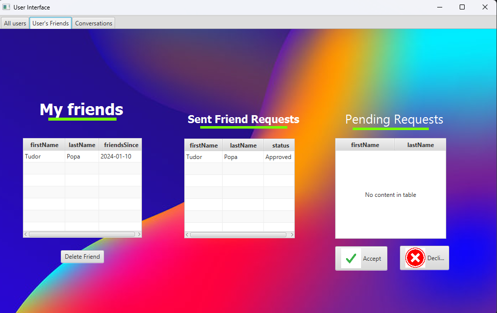
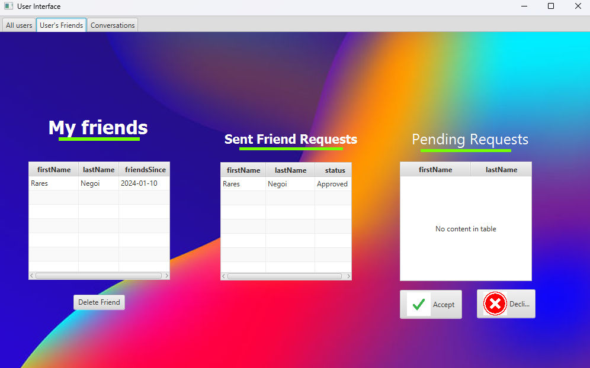
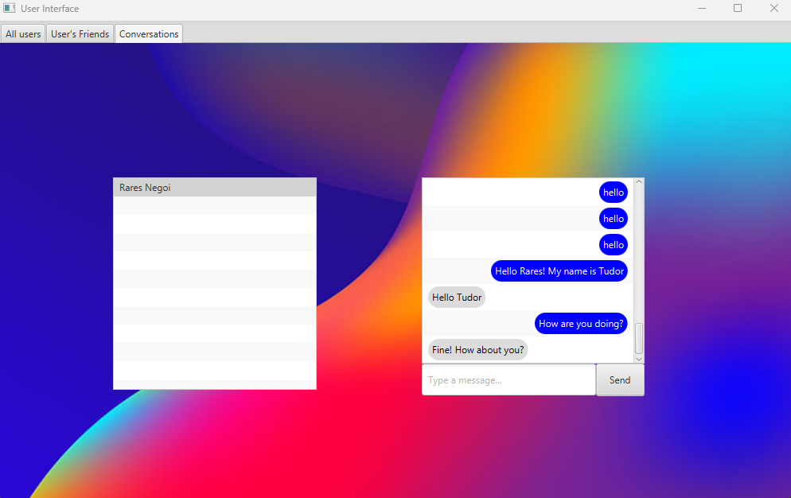
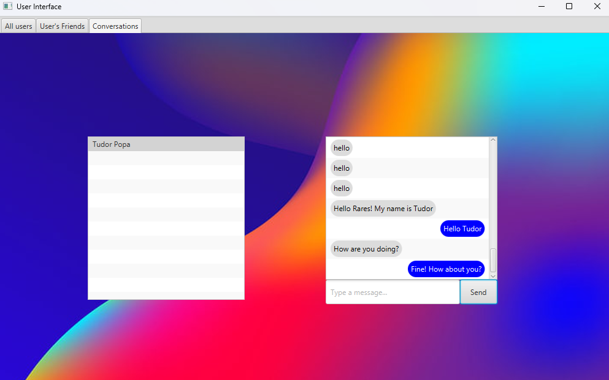

💬💬💬
Implemented a Social-Network application for my personal project, utilizing Java for back-end functionality where I adhered closely to the SOLID principles, PostgreSQL for efficient data storage with Hibernate for Object Relational Mapping, and JavaFX for the front-end interface.
Also implemented a robust multi-threaded server in Java to host user connections, incorporating socket communication for seamless messaging between logged-in users.
Implemented a *layered architecture* with crucial roles for each class to ensure the code's successful operation. Utilized  RepositoryDB classes to connect the code to the Postgres database.

Check some screenshots of the application: 💬💬💬

